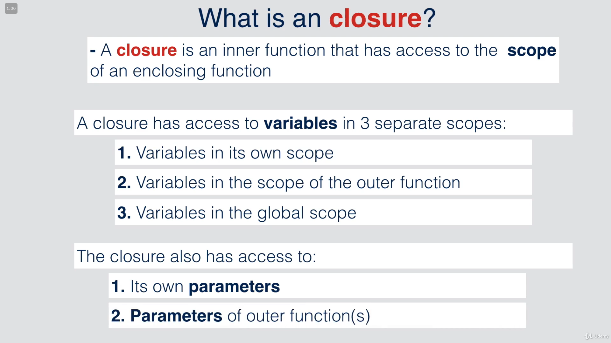
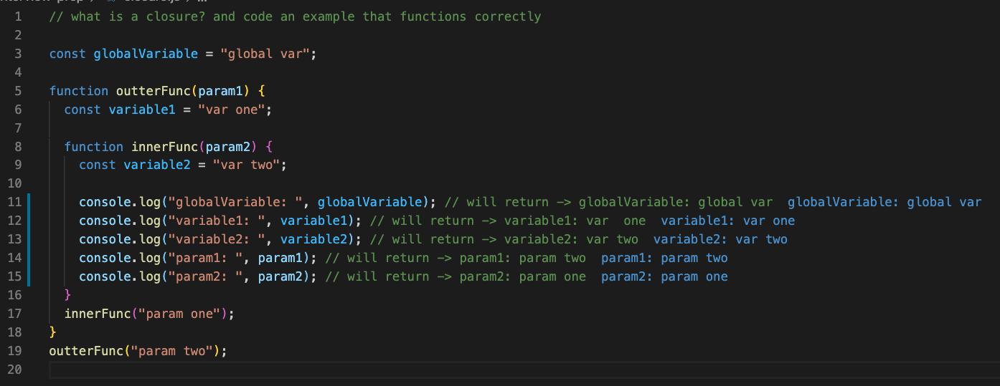
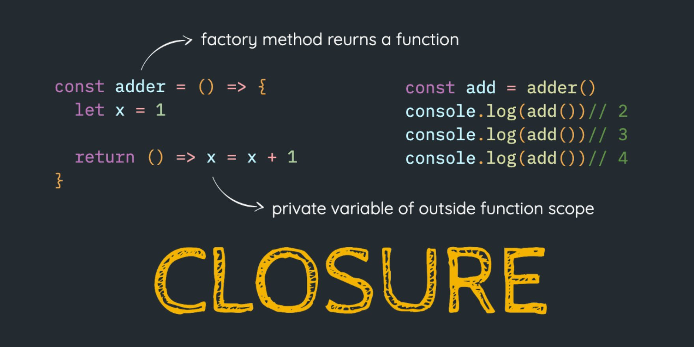

# Interview Prep
[Back to main README.md](../README.md)

#### table of contents
- [Closures](#closure)
- [This keyword](#this)
- [Hoisting](#hoisting)
- [Scope and "self"](#scope-and-"self")
- [Equals vs strict Equals](#equals-vs-strict-equals)
- [Log Number Functions](#log-number-functions)
- [Use Strict](#use-strict)
- [Curry Function](#curry-function)
- [Counter Function](#counter-function)

----

## [Closure](closure.js)

- here's a code example of closures

## [This Keyword](thisKeyword.js)
- global window object return when console logging `this`since in this example we're not inside any other object

- `this` keyword references whatever object it's inside of, so if you just console.log(this) it'll out the global window object, but if you create an object, you can use `this` to reference any given property inside the { }

- few examples of using `this` keyword within a couple of {objects}

---

## Hoisting

---

## Scope and "self"

---

## Equals vs strict Equals

---

## Log Number Functions

---

## use strict

---

## Curry Function

---

## Counter Function

---

