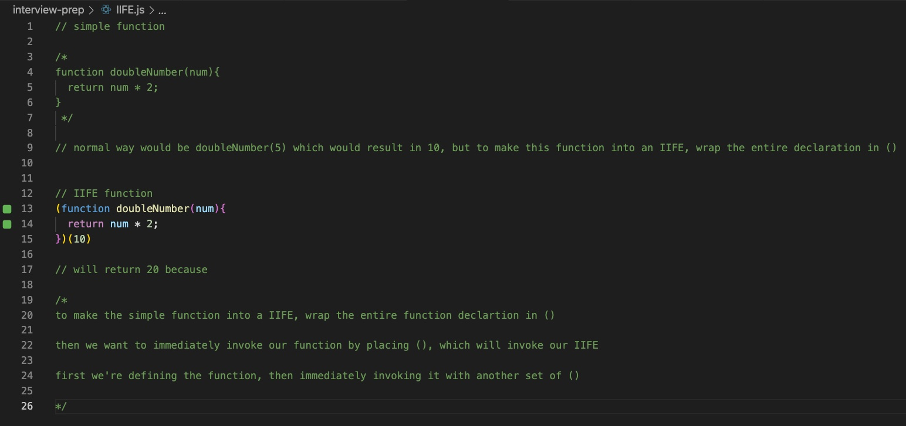
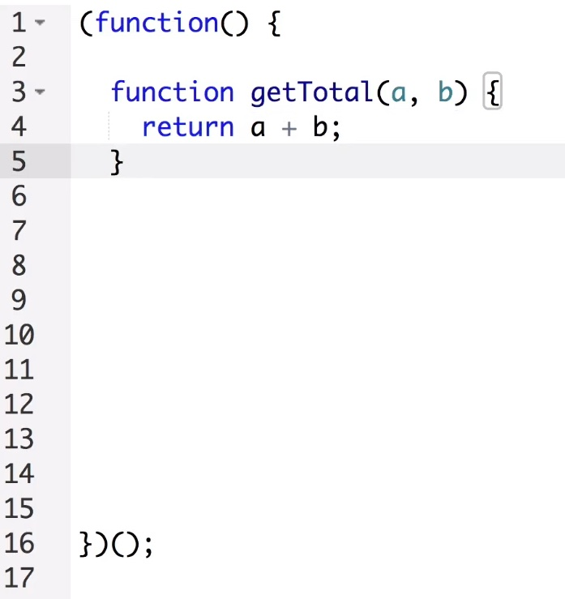
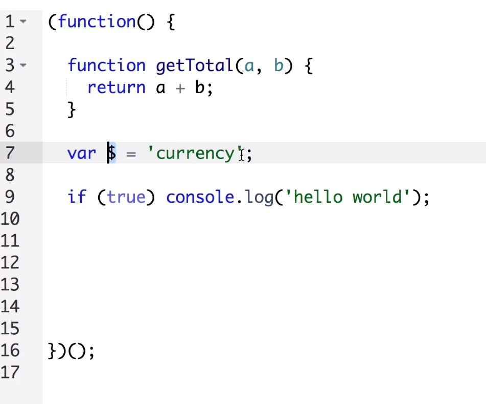

# Interview Prep

[Back to main README.md](../README.md)

#### table of contents

- [IIFE](#IIFE)
- [Closures](#closure)
- [This Keyword](#this-keyword)
- [Hoisting](#hoisting)
- [Scope and "self"](#scope-and-"self")
- [Equals vs strict Equals](#equals-vs-strict-equals)
- [Log Number Functions](#log-number-functions)
- [Use Strict](#use-strict)
- [Curry Function](#curry-function)
- [Counter Function](#counter-function)
- [Misc Questions](#misc-questions)

---

## [IIFE](IIFE.js)

### What is an IIFE and why are they used?
- IIFE = Immedidately Invoked Function Expression
- Which is a function that is executed right after it is created e.g.
  

another example with jquery

and

---

## [Closure](closure.js)

### What is an closure?

- A closure is an inner function that has access to the scope of an enclosing function

- Closures has access to variables in 3 separate scopes: 
1. variables in its own scope
2. variables in the scope of the outer function
3. variables in the global scope

The closure also has access to:
1. its own parameters
2. parameters of outer function(s)

here's a code example of closures
  
  

## [This Keyword](thisKeyword.js)

- global window object return when console logging `this` since in this example we're not inside any other object

- `this` keyword references whatever object it's inside of, so if you just console.log(this) it'll out the global window object, but if you create an object, you can use `this` to reference any given property inside the { }

- few examples of using `this` keyword within a couple of {objects}
  

---

## Hoisting

---

## Scope and "self"

---

## Equals vs strict Equals

---

## Log Number Functions

---

## use strict

---

## Curry Function

---

## Counter Function

---

## Misc Questions

<strong>How do we add JS onto a page?</strong>

  
Generally you can place

  <xmp></xmp>
  
if the script is small in the head title or bottom of page, or if your script is large

  <xmp></xmp>
  
Another alternative is via script tags e.g.<xmp></xmp>

<strong>What are the types used in JS?</strong>

  
Strings, Numbers, Booleans, Functions, Objects, Null, and Undefined

<strong>What are the boolean operators supported by JS?</strong>

  
And Operator: &&

  
Or Opperator: ||

  
Not Operator: !

<strong>Short The difference between "==" and "==="?</strong>

  
"==" checks equality only

  
"===" checks for equality as well as the type

<strong>How to access the value of a textbox using JS?</strong>

  <xmp><body>
    Full name: <input type="text" id="txtFullName" name="firstName" value="Jr">
    
  </body></xmp>

  or the old way:
  <pre></pre>

<strong>How will you get the checkbox status whether its checked or not?</strong>

 <pre>
  let status = document.getElementById("checkbox").checked;
  alert(status);
  //will return true or false
 </pre>

<strong>How to create arrays</strong>

 
There are two ways

 
1st way is to declare an array e.g.

  <pre>
    let names = new Array();
    Add Elements in Array:
    names[0] = "Jr";
    names[1] = "Junior";
    names[2] = "J"
  </pre>
 
The other way to create arrays

  <pre>
    let names = new Array("Jr", "junior", "J");
  </pre>

<strong>If an array with name as "names" contain 3 elements, how will you print the 3rd element?</strong>

  <pre>
    document.write(names[2]);
  </pre>

<strong>How to submit a form using JS</strong>

  <pre>
    document.forms[0].submit()
  </pre>

<strong>What does isNaN function do?</strong>

  
it returns true if the arg is not a number

---
